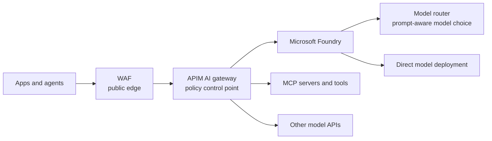

# Azure AI gateway field guide

Last reviewed: May 2026

One-page field guide for where WAF, Azure API Management (APIM) AI gateway, Microsoft Foundry model router, MCP governance, and OWASP controls fit.

This is practitioner guidance, not official Microsoft documentation. Check current Microsoft Learn pages for feature status, regions, tiers, limits, and pricing.

## The whole model

## Key points

- **WAF protects the HTTP edge.** Keep it for public endpoints, DDoS, bots, and classic web attacks. Do not treat it as complete AI security.
- **APIM AI gateway governs AI traffic.** Use it for identity, authorization, token limits, content safety, semantic cache, backend routing, failover, logging, and MCP/tool policy.
- **Model router is not a gateway.** It is a Foundry model deployment that chooses an eligible underlying model per prompt. It optimizes model choice; it does not replace APIM.
- **MCP tools are APIs.** Register them, authenticate callers, validate schemas, set quotas, log calls, pin versions, and require approval for high-impact actions.
- **OWASP controls need layers.** Prompt and agent risks map across Microsoft Entra ID, APIM, Prompt Shields, Purview, Foundry evaluations/tracing, Defender, and human approval.

## Decision table

| Need | Use | Not enough on its own |
|---|---|---|
| Public AI endpoint | WAF + DDoS | WAF cannot understand prompts, model outputs, or tool intent. |
| Shared AI control point | APIM AI gateway | Gateway policy does not replace app authorization or data governance. |
| Prompt-aware model choice | Foundry model router | Model router does not provide enterprise gateway governance. |
| Govern agent tools | APIM as MCP gateway + API Center | Tool discovery without policy invites tool poisoning and misuse. |
| Stop runaway cost | APIM token limits + budget alerts | Request-rate limits miss high-token prompts and agent loops. |
| Regulated or fixed-model workload | APIM to direct deployment | Model router may select a different eligible model. |

## Minimum production checklist

- Use Microsoft Entra ID or managed identity where possible.
- Keep raw model keys out of application code.
- Enforce token quotas by app, team, user, or agent.
- Apply Prompt Shields or equivalent checks for direct and indirect prompt injection.
- Validate model output before downstream systems execute or render it.
- Treat MCP tools as production APIs with schema validation and audit logs.
- Trace user, agent, model, tool, and outcome with correlation IDs.
- Add a kill switch for runaway agents or compromised tools.

## References

- [AI gateway capabilities in Azure API Management](https://learn.microsoft.com/en-us/azure/api-management/genai-gateway-capabilities)
- [MCP server support in Azure API Management](https://learn.microsoft.com/en-us/azure/api-management/mcp-server-overview)
- [Microsoft Foundry model router](https://learn.microsoft.com/en-us/azure/foundry/openai/concepts/model-router)
- [Azure AI Content Safety Prompt Shields](https://learn.microsoft.com/en-us/azure/ai-services/content-safety/concepts/jailbreak-detection)
- [OWASP Top 10 for LLM Applications](https://genai.owasp.org/llm-top-10/)
- [OWASP MCP Security Cheat Sheet](https://cheatsheetseries.owasp.org/cheatsheets/MCP_Security_Cheat_Sheet.html)
