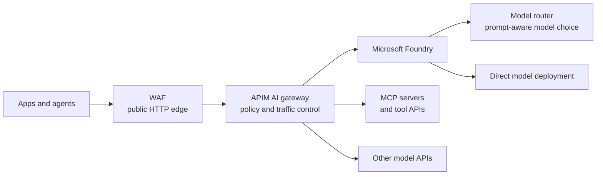
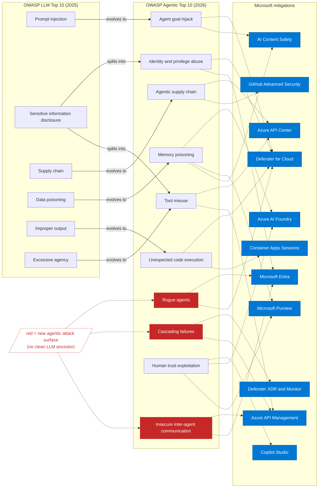

# Gateways in Microsoft Foundry

Last reviewed: May 2026

Use this guide to choose the right gateway control point for AI traffic in and around Microsoft Foundry. A web application firewall (WAF), Azure API Management (APIM) AI gateway, Microsoft Foundry model router, Model Context Protocol (MCP) gateway, and Open Worldwide Application Security Project (OWASP) controls solve different problems.

This guide isn't official Microsoft documentation. Check current Microsoft Learn pages for feature status, regions, tiers, limits, and pricing.

## Start with the layers

The architecture is layered on purpose. Use each layer for the control it is good at, and don't expect one layer to cover the others.

| Layer | Use it for | Don't use it for |
|---|---|---|
| WAF | Public HTTP protection, distributed denial-of-service (DDoS) protection, bot controls, classic web attacks | Prompt intent, model output quality, tool safety, or agent behavior |
| APIM AI gateway | Identity, authorization, token budgets, content safety, backend routing, logging, resilience, MCP policy | Replacing application authorization, data governance, or model evaluation |
| Foundry model router | Choosing an eligible model for each prompt inside Microsoft Foundry | Enterprise gateway governance, cross-provider policy, or tool governance |
| MCP gateway and registry | Governing which tools agents can discover and call | Trusting tool calls just because an agent requested them |

## Use APIM as the AI traffic control point

APIM AI gateway is Azure API Management applied to AI traffic. It is the place to apply consistent policy before requests reach models, agents, or tools.

| Capability | What APIM exposes | Why it matters |
|---|---|---|
| Endpoint onboarding | Foundry, Azure OpenAI, Azure AI Model Inference, OpenAI-compatible endpoints, MCP servers, and agent-to-agent APIs | Brings AI endpoints into the same gateway and developer access model as other APIs |
| Backend access | Managed identity, credential manager, and backend credentials | Keeps model keys out of application code |
| Token control | Token-limit policies, token prechecks, and token metrics | Controls spend, prevents token spikes, and supports showback |
| Safety checks | Content safety policies with Prompt Shields and category thresholds | Screens prompts and responses at the gateway |
| Performance | Semantic cache policies and backend pools | Reduces repeat model calls and spreads traffic across healthy backends |
| Resilience | Retry, load-balancing, and circuit-breaker policies | Reduces the effect of throttled or unhealthy model deployments |
| Tool governance | REST-to-MCP export, pass-through MCP governance, rate limits, quotas, and validation | Protects tools used by agents, not only model endpoints |
| Foundry integration | Foundry portal integration, where available, to associate an APIM-backed AI gateway | Lets teams work from Foundry while keeping APIM as the gateway |

The short version: use APIM when you need shared policy. Use model router when you need prompt-aware model choice. Use both when you need governed traffic and smart model selection.

## Keep model routing separate from gateway routing

Model router is a Foundry model deployment. It chooses an eligible underlying model for each prompt based on routing mode, model subset, quality, cost, latency, and availability.

APIM routes traffic. It decides which approved backend, region, provider, API, or MCP server a caller can reach. It also enforces identity, quotas, safety policies, logging, and resilience controls.

| Scenario | Pattern |
|---|---|
| Need one approved model | APIM to direct model deployment |
| Need prompt-aware model choice | Foundry model router |
| Need governance and prompt-aware model choice | APIM AI gateway to model router |
| Need multi-provider or cross-region policy | APIM AI gateway |

## Keep the WAF, but don't stop there

If an AI endpoint is public, keep a WAF in front of it. It helps with the web edge: DDoS protection, bots, request floods, known exploit patterns, request size limits, and protocol hygiene.

A WAF can't understand prompt injection, tool misuse, memory poisoning, model output leakage, or runaway agent behavior. Those risks need AI-aware controls at the gateway, identity, data, model, and operations layers.

## Map agentic risks to layered controls

The following map uses the later consolidated OWASP Agentic AI mapping from the mitigation work. It supersedes the earlier reference draft and shows why AI security can't be reduced to a WAF rule set.

Red nodes are new agentic attack surfaces with no clean large language model (LLM) equivalent. Blue nodes are Microsoft mitigation areas.

| Agentic risk | WAF role | Main controls |
|---|---|---|
| Agent goal hijack | Partial edge filter | Prompt Shields, Foundry safety evaluators, Defender for Cloud |
| Tool misuse | Protects public tool endpoints only | APIM request validation, Azure API Center, Microsoft Purview data loss prevention |
| Identity and privilege abuse | Not the control point | Microsoft Entra ID, workload identity, Conditional Access, Defender |
| Agentic supply chain | Protects public plugin endpoints only | GitHub Advanced Security, API Center registry, signed artifacts, APIM as MCP gateway |
| Unexpected code execution | Not enough | Sandboxed execution, output validation, egress controls, Defender |
| Memory and context poisoning | Helps only if ingestion is a public HTTP path | Purview, retrieval access control, groundedness checks, Foundry evaluations |
| Insecure inter-agent communication | Not a trust model | Microsoft Entra ID, APIM mutual TLS, token validation, private endpoints |
| Cascading failures | Helps with request-rate controls | APIM quotas, circuit breakers, Foundry tracing, Azure Monitor |
| Human-agent trust exploitation | Not applicable | Audit trails, citations, Foundry evaluations, human approval |
| Rogue agents | Helps throttle public calls | Defender, Microsoft Entra lifecycle controls, APIM quotas, emergency stop |

## Minimum design checklist

- Which layer enforces identity and authorization?
- Which layer enforces token budgets?
- Which layer screens prompts and responses?
- Which tools can agents discover and call?
- Which actions need human approval?
- Which logs connect user, agent, model, tool, and outcome?
- Which control stops runaway agents or compromised tools?
- Which workloads must use a fixed model instead of model router?

## References

- [AI gateway capabilities in Azure API Management](https://learn.microsoft.com/en-us/azure/api-management/genai-gateway-capabilities)
- [MCP server support in Azure API Management](https://learn.microsoft.com/en-us/azure/api-management/mcp-server-overview)
- [Microsoft Foundry model router](https://learn.microsoft.com/en-us/azure/foundry/openai/concepts/model-router)
- [Azure AI Content Safety Prompt Shields](https://learn.microsoft.com/en-us/azure/ai-services/content-safety/concepts/jailbreak-detection)
- [OWASP Top 10 for LLM Applications](https://genai.owasp.org/llm-top-10/)
- [OWASP MCP Security Cheat Sheet](https://cheatsheetseries.owasp.org/cheatsheets/MCP_Security_Cheat_Sheet.html)
