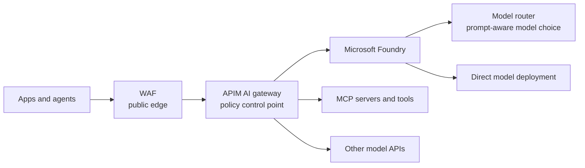
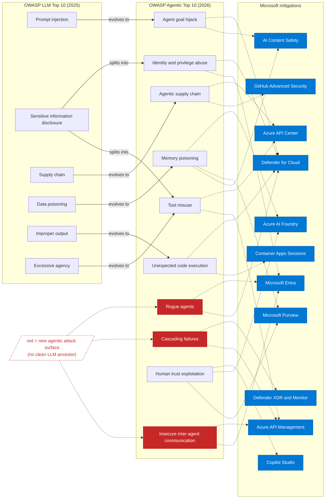

# Azure AI gateway field guide

Last reviewed: May 2026

Use this guide to decide where a web application firewall (WAF), Azure API Management (APIM) AI gateway, Microsoft Foundry model router, Model Context Protocol (MCP) governance, and Open Worldwide Application Security Project (OWASP) controls fit.

This guide isn't official Microsoft documentation. Check current Microsoft Learn pages for feature status, regions, tiers, limits, and pricing.

## Architecture

## Key points

- **WAF protects the HTTP edge.** Use it for public endpoints, distributed denial-of-service (DDoS) protection, bots, and classic web attacks. It isn't complete AI security.
- **APIM AI gateway governs AI traffic.** Use it for identity, authorization, token limits, content safety, semantic cache, backend routing, failover, logging, and MCP tool policy.
- **Model router isn't a gateway.** It chooses an eligible underlying model for each prompt in Microsoft Foundry. It optimizes model choice. It doesn't replace APIM.
- **MCP tools are APIs.** Register them, authenticate callers, validate schemas, set quotas, log calls, pin versions, and require approval for high-impact actions.
- **OWASP controls need layers.** Map prompt and agent risks across Microsoft Entra ID, APIM, Prompt Shields, Purview, Foundry evaluations and tracing, Defender, and human approval.

## Agentic risk map

Use the newer consolidated OWASP map: large language model (LLM) risks become broader agentic system risks when agents plan, call tools, keep memory, and talk to other agents.

Red nodes are new agentic attack surfaces with no clean LLM equivalent. Blue nodes are Microsoft mitigation areas.

## Agentic threats and WAF coverage

| Agentic risk | Primary controls | Where a regular WAF helps |
|---|---|---|
| ASI01: Agent goal hijack | Prompt Shields, Foundry safety evaluators, Defender for Cloud | Partial. It may block obvious malicious request patterns, but it can't understand goal hijack. |
| ASI02: Tool misuse | APIM request validation, Azure API Center, Purview data loss prevention (DLP) | Partial. It can protect public tool endpoints from classic web attacks, not unsafe tool intent. |
| ASI03: Identity and privilege abuse | Microsoft Entra ID, workload identity, Conditional Access, Defender | Low. Use identity controls; WAF doesn't govern tokens or permissions. |
| ASI04: Agentic supply chain | GitHub Advanced Security, API Center registry, signed artifacts, APIM as MCP gateway | Low. It can protect public plugin endpoints, not package or tool provenance. |
| ASI05: Unexpected code execution | Sandboxed execution, output validation, egress controls, Defender | Low. Use runtime isolation; WAF rules aren't enough for generated code paths. |
| ASI06: Memory and context poisoning | Purview, retrieval access control, groundedness checks, Foundry evaluations | Partial. It can help if ingestion is a public HTTP endpoint, but it can't judge semantic poisoning. |
| ASI07: Insecure inter-agent communication | Microsoft Entra ID, APIM mutual TLS, token validation, private endpoints | Low. Use authenticated channels; WAF isn't a trust model for agent-to-agent calls. |
| ASI08: Cascading failures | APIM quotas, circuit breakers, Foundry tracing, Azure Monitor | Partial. Request-rate rules help at the edge; token and tool budgets catch AI loops. |
| ASI09: Human-agent trust exploitation | Purview Audit, citations, Foundry evaluations, human approval | Low. This is a workflow and trust problem, not a web-edge problem. |
| ASI10: Rogue agents | Defender, Microsoft Entra lifecycle controls, APIM quotas, emergency stop | Partial. It can throttle public calls, but it can't contain agent autonomy. |

## What APIM AI gateway adds

| Capability | What APIM exposes | Value |
|---|---|---|
| AI endpoint onboarding | Import and manage Foundry, Azure OpenAI, Azure AI Model Inference, OpenAI-compatible endpoints, MCP servers, and agent-to-agent APIs | Brings AI endpoints into the same gateway, policy, catalog, and developer access model as other APIs |
| Managed identity and credentialed access | Managed identity authentication, credential manager, and backend credentials | Centralizes backend access and keeps application code away from model keys |
| Token limits and quotas | `llm-token-limit` and `azure-openai-token-limit` policies | Controls spend, prevents token spikes, and allocates model capacity fairly |
| Prompt-token prechecks | Token policies with prompt-token estimation | Rejects oversized prompts before a model call |
| Token metrics and showback | `llm-emit-token-metric` and `azure-openai-emit-token-metric` policies | Sends prompt, completion, and total-token metrics to Application Insights and Azure Monitor |
| Prompt and response safety | `llm-content-safety` with prompt shielding and category thresholds | Adds gateway-level screening before or after model execution |
| Semantic caching | `llm-semantic-cache-lookup/store` and `azure-openai-semantic-cache-lookup/store` policies | Reuses similar responses to reduce latency and model cost |
| Model and backend governance | APIM backends, backend pools, routing policies, and allowlist logic | Controls which models, deployments, providers, or regions are used |
| Load balancing and resilience | Load-balanced backend pools, retries, and circuit breaker | Reduces the effect of throttled or unhealthy backends |
| Per-user, per-agent, or per-tool rate limiting | `rate-limit-by-key`, `quota-by-key`, and related APIM policies | Protects model, agent, and tool paths from loops and noisy tenants |
| MCP and tool governance | REST-to-MCP export, pass-through MCP governance, and standard APIM policy controls | Protects and governs tools used by agents, not only model endpoints |
| Foundry-integrated gateway experience | Foundry portal integration, where available, to create or associate an APIM-backed AI gateway | Lets teams govern Foundry models, agents, and tools from a Foundry workflow while retaining APIM as the gateway |

## Decision table

| Need | Use | Limit |
|---|---|---|
| Public AI endpoint | WAF and DDoS protection | WAF can't understand prompts, model outputs, or tool intent. |
| Shared AI control point | APIM AI gateway | Gateway policy doesn't replace app authorization or data governance. |
| Prompt-aware model choice | Foundry model router | Model router doesn't provide enterprise gateway governance. |
| Govern agent tools | APIM as MCP gateway + Azure API Center | Tool discovery without policy invites tool poisoning and misuse. |
| Stop runaway cost | APIM token limits and budget alerts | Request-rate limits miss high-token prompts and agent loops. |
| Regulated or fixed-model workload | APIM to direct deployment | Model router may select a different eligible model. |

## Minimum production checklist

- Use Microsoft Entra ID or managed identity where possible.
- Keep model keys out of application code.
- Enforce token quotas by app, team, user, or agent.
- Apply Prompt Shields or equivalent checks for direct and indirect prompt injection.
- Validate model output before downstream systems execute or render it.
- Treat MCP tools as production APIs with schema validation and audit logs.
- Trace user, agent, model, tool, and outcome with correlation IDs.
- Add an emergency stop for runaway agents or compromised tools.

## References

- [AI gateway capabilities in Azure API Management](https://learn.microsoft.com/en-us/azure/api-management/genai-gateway-capabilities)
- [MCP server support in Azure API Management](https://learn.microsoft.com/en-us/azure/api-management/mcp-server-overview)
- [Microsoft Foundry model router](https://learn.microsoft.com/en-us/azure/foundry/openai/concepts/model-router)
- [Azure AI Content Safety Prompt Shields](https://learn.microsoft.com/en-us/azure/ai-services/content-safety/concepts/jailbreak-detection)
- [OWASP Top 10 for LLM Applications](https://genai.owasp.org/llm-top-10/)
- [OWASP MCP Security Cheat Sheet](https://cheatsheetseries.owasp.org/cheatsheets/MCP_Security_Cheat_Sheet.html)
